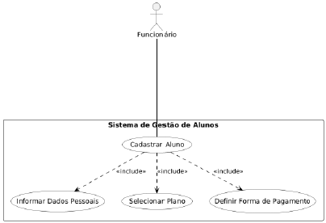
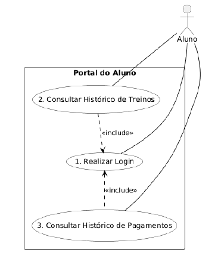
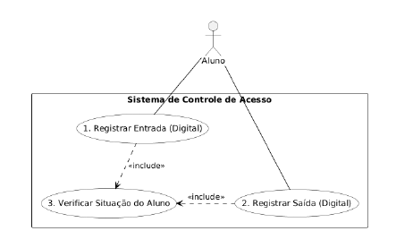
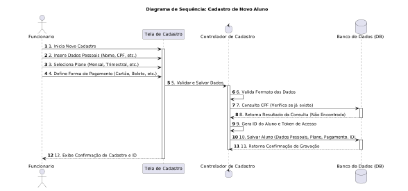
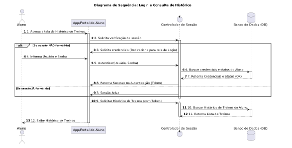
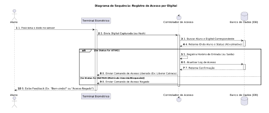
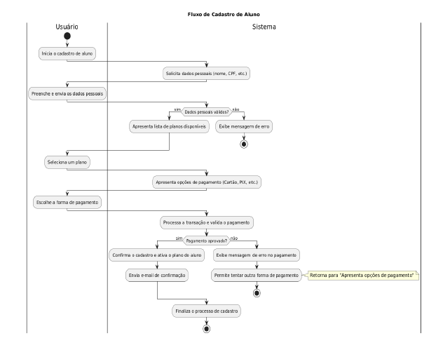
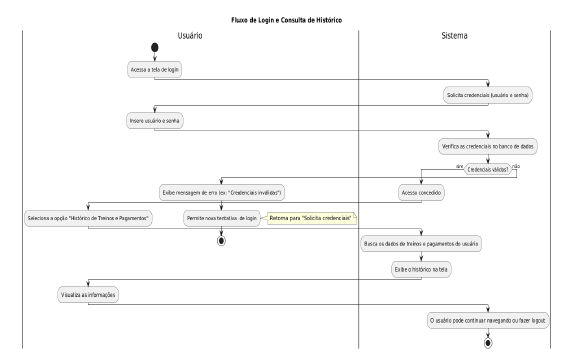
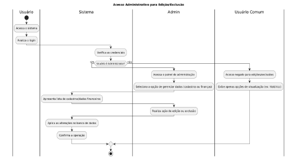
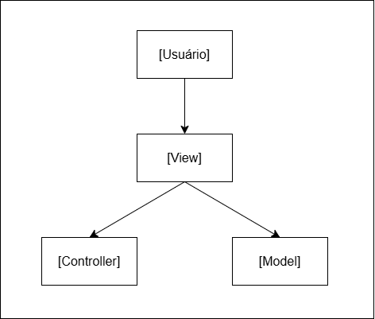

# Especificação de Requisitos do Sistema (ERS/SRS)

## Descrição Geral do Sistema
O GymControl é um sistema voltado para academias que permite o cadastro e gerenciamento de alunos, instrutores, modalidades de treino, horários e pagamentos. O sistema também possibilita o controle de presença e inadimplência, além de fornecer relatórios de desempenho e histórico de treinos.

---

## Requisitos Gerais

### Requisitos Funcionais (RF)
| ID | Descrição | Prioridade |
|----|------------|-----------|
| RF01 | O sistema deve permitir o cadastro de novos alunos com dados pessoais, plano escolhido e forma de pagamento. |Essencial|
| RF02 | O sistema deve permitir que realize login para consultar seu histórico de treinos e pagamentos. |Essencial |
| RF03 | O sistema deve permitir o controle de entrada e saída de alunos através da digital. | Importante |

### Requisitos Não Funcionais (RNF)
| ID | Descrição | Prioridade |
|----|------------|-----------|
| RNF01 | O sistema deve mostrar um resumo financeiro (mensal e anual) deve ser concluída no máximo 5 segundos, independente da quantidade de dados. | Importante |
| RNF02 | Deve ser realizado um backup completo dos dados do sistema diariamente, de forma automatizada, garantindo a retenção dos últimos 30 dias. | Essencial |
| RNF03 | As senhas de acesso de todos os usuários devem ser armazenadas. | Essencial |

### Regras de Negócio (RN)
| ID | Descrição | Prioridade |
|----|------------| -----------|
| RN01 | Cada usuário deve possuir apenas um cadastro ativo, identificado pelo CPF. | Essencial |
| RN02 | Alunos com mensalidade vencida a mais de 30 dias terão acesso suspenso ao sistema. | Essencial | Essencial |
| RN03 | Apenas administradores podem editar/excluir cadastros e editar dados financeiros. | Essencial | Essencial |

---

## Diagramas UML

### Diagrama de Casos de Uso

### Diagrama de Sequência

### Diagrama de Atividades

---

## Arquitetura do Sistema
O sistema adota o estilo arquitetural **MVC (Model–View–Controller)**, separando responsabilidades entre:
- **Model:** lógica e acesso a dados.  
- **View:** interface e interação com o usuário.  
- **Controller:** coordenação entre as camadas.

- 